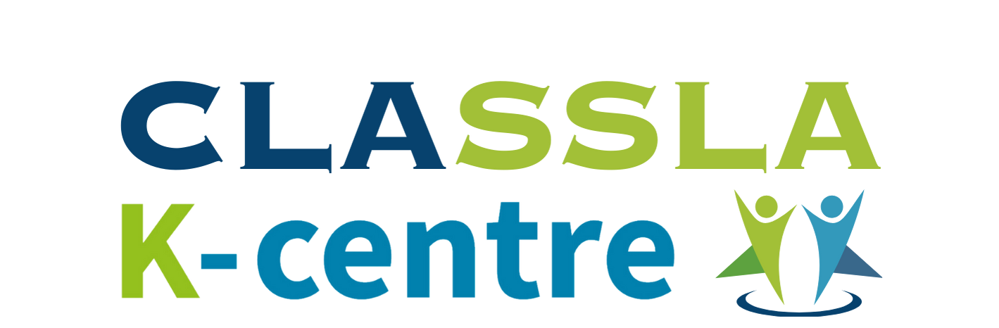

# Slovenian Language Technologies Overview
A collaborative overview of the knowledge on large language models (LLMs), speech technologies, and other natural-language processing (NLP) technologies for Slovenian language. The overview is curated by the [CLARIN Knowledge Centre for South Slavic languages CLASSLA](https://www.clarin.si/info/k-centre/).

For an overview of freely-available datasets for Slovenian language, including general **text collections, and training and test datasets** for various NLP tasks, see the [Frequently-Asked Questions for Slovenian](https://www.clarin.si/info/k-centre/faq4slovene/), provided by CLASSLA. The FAQ also provides information about resources and technologies for linguistic annotation of Slovenian texts.

Main sites where you can find language technologies for Slovenian:
- [CLARIN.SI repository](https://www.clarin.si/repository/xmlui/)
- [CJVT organization profile at Hugging Face](https://huggingface.co/cjvt)
- [CLASSLA organization profile at Hugging Face](https://huggingface.co/classla)

Content:
- [Generative models (LLMs) for Slovenian](#generative-models-llms-for-slovenian)
- [Embedding models & RAG for Slovenian](#embedding-models--rag-for-slovenian)
- [Machine translation for Slovenian](#machine-translation-for-slovenian)
- [BERT-like pretrained models for Slovenian](#bert-like-pretrained-models-for-slovenian)
- [Fine-tuned models for Slovenian](#fine-tuned-models-for-slovenian)
- [Speech technologies for Slovenian](#speech-technologies-for-slovenian)
- [Other language technologies for Slovenian](#other-language-technologies-for-slovenian)
- [Authors](#authors)

## Generative Models (LLMs) for Slovenian

**Open-Source Instruction-Tuned Models**:
- specialised for Slovenian: recently-available instruction-tuned GaMS model by [CJVT](https://huggingface.co/cjvt): [GaMS-1B-Chat](https://huggingface.co/cjvt/GaMS-1B-Chat) ([Vreš et al., 2024](https://www.sdjt.si/wp/wp-content/uploads/2024/09/JT-DH-2024_Vres_Bozic_Potocnik_Martincic_Robnik.pdf)): 1B model, developed as part of the [POVEJMO](https://povejmo.si/) project - bigger models will follow as the final products of this project
- multilingual models that performed well on Slovenian and South Slavic languages (and dialects) based on the COPA task (see [paper by Ljubešić et al., 2024](https://aclanthology.org/2024.vardial-1.18.pdf)):
	- [Mixtral](https://huggingface.co/mistralai/Mixtral-8x7B-Instruct-v0.1)
	- [mt0-xxl](https://huggingface.co/bigscience/mt0-xxl)
	- [Aya](https://huggingface.co/CohereForAI/aya-101)
- other open-source instruction-tuned and base models that are often used by researchers for fine-tuning experiments in Slovenian language:
	- Llama model families [Llama 3.1](https://huggingface.co/collections/meta-llama/llama-31-669fc079a0c406a149a5738f) and [Llama 3.2](https://huggingface.co/collections/meta-llama/llama-32-66f448ffc8c32f949b04c8cf): Llama 3.1 provides good results for Slovenian summarization,
	- [Gemma](https://huggingface.co/google/gemma-7b) and instruction-tuned [Gemma-it](https://huggingface.co/google/gemma-7b-it) models: slightly worse results in Slovenian summarization.
- based on experience (e.g., [paper by Ljubešić et al., 2024](https://aclanthology.org/2024.vardial-1.18.pdf), using its predecesor GPT-4), [closed-source GPT-4o by OpenAI](https://openai.com/index/hello-gpt-4o/) still performs the best for Slovenian for classification tasks

**Other Decoder-Style Models**:
- [t5-sl-small](https://huggingface.co/cjvt/t5-sl-small) and [t5-sl-large](https://huggingface.co/cjvt/t5-sl-large) ([Ulčar and Robnik-Šikonja, 2023](https://www.frontiersin.org/journals/artificial-intelligence/articles/10.3389/frai.2023.932519/full)): Slovene T5 models that can be used for generative tasks (summarization, text simplification, etc.). The smaller model exhibits comparable performance to the larger model. However, in scenarios where extensive fine-tuning data is accessible, the larger model is expected to surpass the performance of the smaller model.

**Benchmarks**:
- [SloBench evaluation for generative models](https://github.com/SloLama/slobench_evaluation): a framework that supports evaluation of generative models on SloBench tasks (using Slovene SuperGLUE and SI-NLI datasets).
- [Slovenian LLM Evaluation](https://github.com/SloLama/slovenian-llm-eval): a framework that supports evaluation of generative models on the [Slovenian LLM Evaluation Dataset](https://huggingface.co/datasets/cjvt/slovenian-llm-eval). The dataset comprises multiple common English benchmarks (ARC Challenge, ARC Easy, BoolQ, HellaSwag, NQ Open, OpenBookQA, PIQA, TriviaQA, Winogrande) that were machine-translated to Slovenian.

**Papers**:
- [Generative Model for Less-Resourced Language with 1 Billion Parameters](https://www.sdjt.si/wp/wp-content/uploads/2024/09/JT-DH-2024_Vres_Bozic_Potocnik_Martincic_Robnik.pdf) (Vreš et al., 2024)
- [JSI and WüNLP at the DIALECT-COPA Shared Task: In-Context Learning From Just a Few Dialectal Examples Gets You Quite Far](https://aclanthology.org/2024.vardial-1.18.pdf) (Ljubešić et al., 2024)
- [Sequence-to-sequence pretraining for a less-resourced Slovenian language](https://www.frontiersin.org/journals/artificial-intelligence/articles/10.3389/frai.2023.932519/full) (Ulčar and Robnik-Šikonja, 2023)

## Embedding Models & RAG for Slovenian

**Open-Source Embedding Models**:
- based on paper evaluating retrieval capabilities ([Kuzman et al., 2024](https://is.ijs.si/wp-content/uploads/2024/10/IS2024_Volume-A-DRAFT-1.pdf)), the best smaller-sized open-source embedding models for Slovenian are [BGE-M3](https://huggingface.co/BAAI/bge-m3) and [Multilingual-E5-large](https://huggingface.co/intfloat/multilingual-e5-large)

**Benchmarks**:
- RAG benchmark for retrieval capabilities of the RAG pipeline: [PandaChat-RAG Benchmark](https://github.com/TajaKuzman/pandachat-rag-benchmark)

**Papers**:
- [PandaChat-RAG: Towards the Benchmark for Slovenian RAG Applications](https://is.ijs.si/wp-content/uploads/2024/10/SCAI_2024_paper_0538.pdf) (Kuzman et al., 2024)

## Machine Translation for Slovenian

**Open-Source Models**:
- [No Language Left Behind (NLLB)](https://github.com/facebookresearch/fairseq/tree/nllb) massively multilingual models are frequently used for large-scale machine translation.
- Inside the [ParlaMint](https://www.clarin.eu/parlamint-project-information) project dealing with parliamentary texts, the OPUS-MT models used through [EasyNMT](https://github.com/UKPLab/EasyNMT) library were shown to be the most useful for our purposes. For Slovenian to English, we used the [opus-mt-sla-en](https://huggingface.co/Helsinki-NLP/opus-mt-sla-en) model.
- [Neural Machine Translation model for Slovene-English language pair RSDO-DS4-NMT 1.2.6](https://www.clarin.si/repository/xmlui/handle/11356/1736): MT model, developed inside the [RSDO project](https://rsdo.slovenscina.eu/en/machine-translation). There is a [demo](https://www.slovenscina.eu/en/prevajalnik) available. Code for the API service is [available here](https://github.com/clarinsi/Slovene_NMT).

**Benchmarks**:
- SloBench Machine Translation benchmarks: [Slovenian-to-English](https://slobench.cjvt.si/leaderboard/view/7) and [English-to-Slovenian](https://slobench.cjvt.si/leaderboard/view/8)

**Papers**:

##  BERT-Like Pretrained Models for Slovenian

**Monolingual / Smaller Multilingual Models**:
- [SloBERTa](https://huggingface.co/EMBEDDIA/sloberta): monolingual Slovenian BERT-like model, available also on [the CLARIN.SI repository](http://hdl.handle.net/11356/1397) ([Ulčar and Robnik-Šikonja, 2021](https://aile3.ijs.si/dunja/SiKDD2021/Papers/Ulcar+Robnik.pdf))
- [CroSloEngual BERT](https://huggingface.co/EMBEDDIA/crosloengual-bert): a trilingual model trained on Croatian, Slovenian, and English corpora ([Ulčar and Robnik-Šikonja, 2020](https://link.springer.com/chapter/10.1007/978-3-030-58323-1_11))
- [SloBERTa-SlEng](https://huggingface.co/cjvt/sloberta-sleng): a Slovenian-English model based on SloBERTa, which was further pre-trained on the conversational English and Slovene corpora. The model is especially appropriate for tasks applied on conversational, non-standard, and slang language ([Yadav et al., 2024](https://arxiv.org/abs/2405.12929)). 
- [sloberta-finetuned-dlib-1850-1919](https://huggingface.co/janezb/sloberta-finetuned-dlib-1850-1919): a SloBERTa model, fine-tuned on Slovenian texts from the period 1850-1919. The texts were collected from the Slovenian Digital Library (https://dlib.si).

**Massively Multilingual Models**:
- [Massively multilingual XLM-RoBERTa](https://huggingface.co/FacebookAI/xlm-roberta-large) model: frequently used for fine-tuning on Slovenian and multilingual data for various NLP tasks ([Conneau et al., 2019](https://aclanthology.org/2020.acl-main.747.pdf))
- [Multilingual parliamentary model XLM-R-parla](https://huggingface.co/classla/xlm-r-parla): XLM-RoBERTa model, additionally pretrained on parliamentary data, including Slovenian, to be used for NLP tasks applied on parliamentary texts ([Mochtak et al., 2024](https://aclanthology.org/2024.lrec-main.1393/))

**Papers**:
- [FinEst BERT and CroSloEngual BERT: less is more in multilingual models](https://link.springer.com/chapter/10.1007/978-3-030-58323-1_11) (Ulčar and Robnik-Šikonja, 2020)
- [Evaluation of contextual embeddings on less-resourced languages](https://arxiv.org/abs/2107.10614) (Ulčar et al., 2021)

## Fine-Tuned Models for Slovenian

**Models & Papers**:
- Sentiment in parliamentary texts: [Multilingual parliament sentiment regression model XLM-R-ParlaSent](https://huggingface.co/classla/xlm-r-parlasent) ([Mochtak et al., 2024](https://aclanthology.org/2024.lrec-main.1393/))
- Text genre prediction: [X-GENRE classifier - multilingual text genre classifier](https://huggingface.co/classla/xlm-roberta-base-multilingual-text-genre-classifier) ([Kuzman et al., 2023](https://www.mdpi.com/2504-4990/5/3/59))
- News topic prediction: [Text classification model SloBERTa-Trendi-Topics 1.0](https://huggingface.co/cjvt/sloberta-trendi-topics) ([Kosem et al., 2023](https://journals.uni-lj.si/slovenscina2/article/download/12073/13790))
- Hate speech classification in social media content: [Multilingual Hate Speech Classifier for Social Media Content](https://huggingface.co/Andrazp/multilingual-hate-speech-robacofi) ([Pelicon et al., 2021](https://peerj.com/articles/cs-559/))
- Summarization of Slovenian texts: [SloSummarizer](https://github.com/RSDO-DS3/SloSummarizer) ([Žagar and Robnik-Šikonja, 2021](https://aclanthology.org/2021.hackashop-1.13/)). Summarization models are available [here](http://hdl.handle.net/11356/1751). Demo is available [here](https://www.slovenscina.eu/povzemanje).
- Slovenian Question-Answering models: [SloQA](https://github.com/clarinsi/SloQA)
- Named Entity Recognition: [PyTorch model for Slovenian Named Entity Recognition SloNER](http://hdl.handle.net/11356/1758). Demo is available [here](https://slovenscina.eu/prepoznavanje-imenskih-entitet). The source code is available on [GitHub](https://github.com/RSDO-DS3/SloNER).
- Coreference Resolution for Slovenian: [PyTorch model for Slovenian Coreference Resolution](http://hdl.handle.net/11356/1773) ([Klemen and Žitnik, 2022](https://doiserbia.nb.rs/Article.aspx?ID=1820-02142100060K)). Demo is available [here](https://slovenscina.eu/odkrivanje-koreferencnosti). The source code is available on [GitHub](https://github.com/RSDO-DS3/SloCOREF).
- Relation Extraction for Slovenian language: [SloREL tool](https://github.com/clarinsi/SloREL)
- Word-sense disambiguation: [SloWSD model](https://github.com/clarinsi/SloWSD)
- Annotation of incorrect spelling in Slovenian language: [SloBERTa Incorrect Spelling Annotator](https://huggingface.co/cjvt/SloBERTa-slo-word-spelling-annotator) 
- Prediction of commonsense descriptions in a natural language: [Slovenian commonsense reasoning model SloMET-ATOMIC 2020](
http://hdl.handle.net/11356/1729) (also available on [GitHub](https://github.com/E3-JSI/model-SloMET-ATOMIC-2020)) ([Mladenić Grobelnik et al., 2022](https://aile3.ijs.si/dunja/SiKDD2022/Papers/SiKDD2022_paper_5674.pdf))
- [Fine-tuned BERT model for semantic frame extraction in olfactory events](https://zenodo.org/records/10598306) ([Menini, 2024](https://aclanthology.org/2024.lrec-main.1273.pdf))

**Benchmarks**:
- [Natural language inference](https://slobench.cjvt.si/leaderboard/view/9) benchmark at SloBench
- [Slovene SuperGLUE](https://slobench.cjvt.si/leaderboard/view/3) benchmark at SloBench ([Žagar and Robnik-Šikonja, 2022](https://aclanthology.org/2022.lrec-1.221/))
- [Named Entity Recognition](https://slobench.cjvt.si/leaderboard/view/12) benchmark at SloBench
- [Universal Dependency Parsing](https://slobench.cjvt.si/leaderboard/view/11) benchmark at SloBench
- [Semantic Change Detection Evaluation Dataset](https://www.clarin.si/repository/xmlui/handle/11356/1651) ([Pranjić et al., 2024](https://arxiv.org/abs/2402.16596))

**Papers**:
- [Code-mixed Sentiment and Hate-speech Prediction](https://arxiv.org/abs/2405.12929) (Yadav et al., 2024)
- [The ParlaSent Multilingual Training Dataset for Sentiment Identification in Parliamentary Proceedings](https://aclanthology.org/2024.lrec-main.1393/) (Mochtak et al., 2024)
- [Automatic Genre Identification for Robust Enrichment of Massive Text Collections: Investigation of Classification Methods in the Era of Large Language Models](https://www.mdpi.com/2504-4990/5/3/59) (Kuzman et al., 2024)
- [Investigating cross-lingual training for offensive language detection](https://peerj.com/articles/cs-559/) (Pelicon et al., 2021)
- [Zero-Shot Learning for Cross-Lingual News Sentiment Classification](https://www.mdpi.com/2076-3417/10/17/5993) (Pelicon et al., 2020)

## Speech Technologies for Slovenian

**Automatic Speech Recognition (ASR) Models**:
- [Slovene Conformer CTC BPE E2E Automated Speech Recognition model RSDO-DS2-ASR-E2E 2.0](http://hdl.handle.net/11356/1737): ASR model, developed inside the [RSDO project](https://rsdo.slovenscina.eu/en/speech-technologies), that is available on the CLARIN.SI repository and [GitHub](https://github.com/clarinsi/Slovene_ASR_e2e) ([demo](https://www.slovenscina.eu/en/razpoznavalnik)). Note: The maximal accepted audio duration is 300s.
- [Whisper](https://huggingface.co/openai/whisper-large-v3) model: open-source OpenAI model that is massively multilingual.

**Other technologies**:
- [Detection of Filled Pauses in Speech](https://huggingface.co/5roop/wav2vecbert2-filledPause)
- [Slovenian Text Normalizator RSDO-DS2-NORM](http://hdl.handle.net/11356/1742), also available on [GitHub](https://github.com/clarinsi/Slovene_normalizator)
- [Slovenian Text Denormalizator RSDO-DS2-DENORM](http://hdl.handle.net/11356/1743), also available on [GitHub](https://github.com/clarinsi/Slovene_denormalizator)
- [Slovenian Grapheme-to-Phoneme Converter](https://github.com/clarinsi/rsdo_gfp_v2)
- [Slovenian Punctuation and Capitalisation model RSDO-DS2-P&C](http://hdl.handle.net/11356/1735), code for an API service available on [GitHub](https://github.com/clarinsi/Slovene_punctuator)
- [Speech Denoising Tool](https://github.com/clarinsi/rsdo_aknorm_v2)

**Benchmarks**:
- [SloBench Speech Recognition benchmark](https://slobench.cjvt.si/leaderboard/view/10)

## Other Language Technologies for Slovenian

**Tools**:
- [Linguistic Processing Pipeline CLASSLA](https://github.com/clarinsi/classla): the CLASSLA pipeline provides processing of standard and non-standard (Internet) Slovene on the levels of tokenization and sentence splitting, part-of-speech tagging, lemmatisation, dependency parsing and named entity recognition ([Ljubešić et al., 2024](https://www.sdjt.si/wp/wp-content/uploads/2024/09/JT-DH_2024-Ljubesic_Tercon_Doborovoljc.pdf)). Demo is available [here](https://clarin.si/oznacevalnik/eng). More information on tools for linguistic annotation of Slovenian texts is available [here](https://www.clarin.si/info/k-centre/faq4slovene/#2_Tools_to_annotate_Slovene_texts).
- [Diacritic restoration tool for Croatian, Serbian and Slovene](https://github.com/clarinsi/redi) ([Ljubešić et al., 2016](https://aclanthology.org/L16-1573/))
- [A System for Semantic Change Detection for Slovenian](https://github.com/RSDO-DS3/SloSemanticShiftDetection?tab=readme-ov-file) ([Montariol et al., 2021](https://aclanthology.org/2021.naacl-main.369/))

## Authors

This document is supported by [CLASSLA](https://www.clarin.si/info/k-centre/), the CLARIN knowledge centre for South Slavic languages. For any questions or suggestions related to this document, write to CLASSLA helpdesk: helpdesk.classla@clarin.si.

To be informed of new resources, technologies, events and projects for South Slavic languages:
- you can subscribe to the [mailing list](https://mailman.ijs.si/mailman/listinfo/classla)
- follow CLARIN.SI on [X](https://x.com/ClarinSlovenia) and [LinkedIn](https://www.linkedin.com/company/clarin-si)
- join the [Discord group "Slovenska skupnost za jezikovne vire in tehnologije"](https://discord.com/invite/vQDRpGMU7C)

The main author and curator of this document is: Taja Kuzman (Department of Knowledge Technologies, Jožef Stefan Institute).

Special thanks also to other contributors:
- Peter Rupnik (Department of Knowledge Technologies, Jožef Stefan Institute)
- Matej Martinc (Department of Knowledge Technologies, Jožef Stefan Institute)
- Erik Novak (Department for Artificial Intelligence, Jožef Stefan Institute)
- Domen Vreš (Faculty of Computer and Information Science, University of Ljubljana)
- Aleš Žagar (Faculty of Computer and Information Science, University of Ljubljana)

